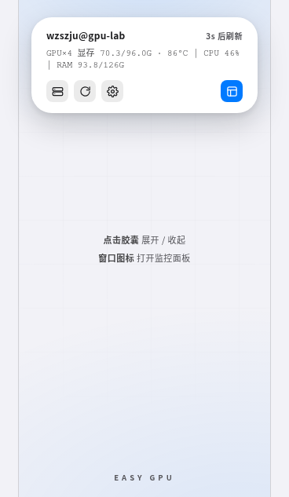
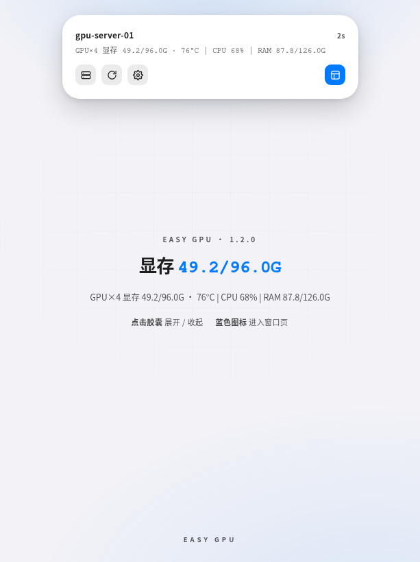
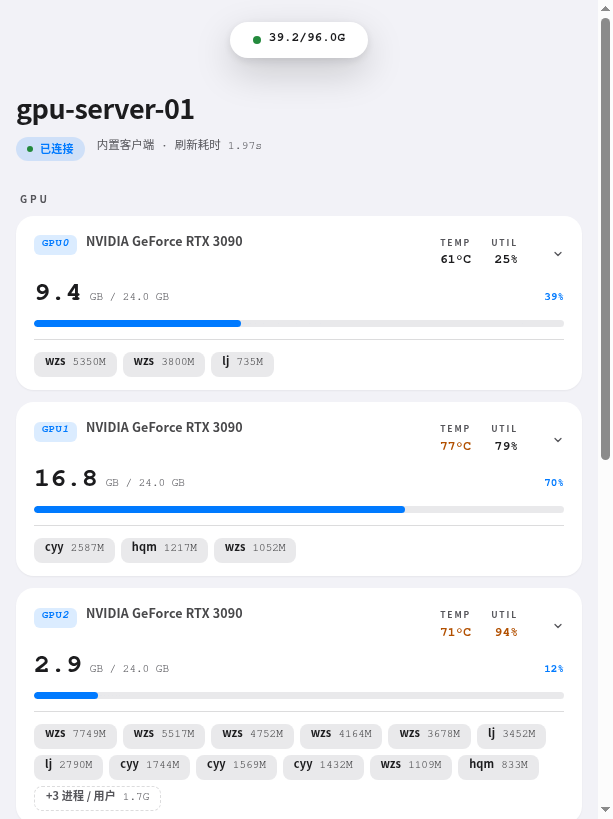

# Easy GPU

TraeCode / VS Code 的远程 GPU 监控面板：灵动岛状态胶囊 + gpustat 风格逐进程显存。

## 1. 作者 / 仓库

1. 作者：[@yourkwan](https://github.com/yourkwan)
2. 仓库：[github.com/yourkwan/easy-gpu](https://github.com/yourkwan/easy-gpu)
3. 反馈：[Issues](https://github.com/yourkwan/easy-gpu/issues)

## 2. 整体预览

1. 侧边栏胶囊：打开 IDE 自动显示，点击展开状态与操作

2. 胶囊页：编辑器面板默认视图，悬浮胶囊常驻顶部

3. 窗口页：GPU / CPU / 内存监控详情，点击显卡可收起 / 展开用户显存

## 3. 功能

1. **悬浮胶囊（灵动岛）**：侧边栏常驻、打开 IDE 自动显示；短胶囊显示显存合计，点击展开长胶囊（主机 + 状态概览 + 倒计时 + 操作图标），再点收起；最后一个「窗口」图标打开编辑器监控面板
2. **双视图面板**：编辑器面板内胶囊页（极简总览）+ 窗口页（监控详情）切换，胶囊常驻悬浮
3. **显存优先**：每卡显存大号等宽数字 + 进度条，温度 / 利用率仅异常时着色；点击显卡收起 / 展开用户显存
4. **逐进程显存**：紧凑芯片式 `wzs 6876M ǀ lj 814M`，可选按用户合并（悬停看明细）
5. **CPU 与内存**：CPU 实时占用 + 历史曲线；内存已用 / 总量 + 缓存与可用
6. **7 种强调色**：蓝 / 青 / 绿 / 紫 / 粉 / 橙 / 红，深浅主题自适应
7. **自动刷新**：默认每 5 秒，带倒计时与手动刷新
8. **三步新建连接**：服务器地址 → 用户名 → 登录方式（密码 / 私钥文件 / ssh-agent 免密）；密码与口令按 `用户@服务器` 存入系统钥匙串
9. **一处式设置**：刷新间隔 / 颜色风格 / 合并进程

## 4. 安装

1. 下载 [Releases](https://github.com/yourkwan/easy-gpu/releases) 中最新的 `.vsix`
2. 扩展面板（`Ctrl+Shift+X`）→ 右上角 `···` → **从 VSIX 安装…** → 重载窗口
3. 源码构建：`npm install && npm run package` 生成 `.vsix` 后同上安装

## 5. 使用

1. **新建连接**：命令面板执行 `Easy GPU: 新建连接`，依次填服务器地址、用户名、登录方式（密码 / 私钥文件 / ssh-agent 免密）
2. **查看监控**：打开 IDE 自动显示侧边栏胶囊（活动栏 Easy GPU 图标可随时手动打开）；点击胶囊展开操作（切换服务器 / 刷新 / 设置 / 窗口），「窗口」图标打开编辑器监控面板；点击显卡收起 / 展开用户显存
3. **切换服务器**：长胶囊「切换服务器」，或 `Easy GPU: 管理连接与密码`（回车连接，右侧按钮修改 / 删除）
4. **手动刷新**：长胶囊「刷新」，或 `Easy GPU: 立即刷新`
5. **设置**：长胶囊「设置」，或 `Easy GPU: 设置` —— 刷新间隔 / 颜色风格 / 合并进程
