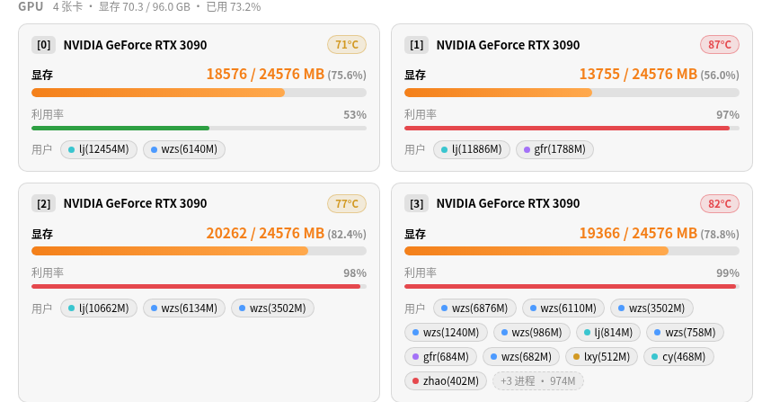
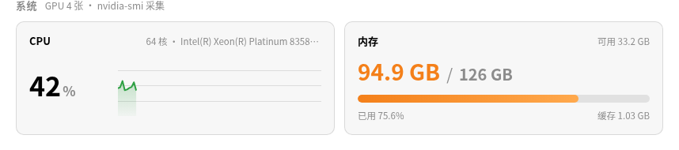

# Easy GPU

> 在 TraeCode / VS Code 中查看远程 SSH 服务器的 GPU、CPU 与内存状态 —— gpustat 风格面板，带逐进程显存占用统计。

  


## 功能

- **显存优先**：每张 GPU 的显存以橙色大号数值 + 粗进度条突出显示，型号、温度、利用率作为辅助信息，温度/利用率按阈值自动变色
- **逐进程显存占用**：gpustat 风格 `wzs(6876M) lj(814M)`，每个进程单独一条、不按用户合并；同一账号多个任务一目了然
- **CPU 与内存**：CPU 实时占用 + 历史曲线；内存已用/总量橙色高亮（`94.9 GB / 126 GB`），附缓存与可用容量
- **状态栏常驻概览**：`GPU×4 显存 72.0/96.0G · 89°C | CPU 62% | RAM 94.6/126G`，点击直达面板
- **自动刷新**：默认每 5 秒，可配置；面板带刷新倒计时与手动刷新按钮
- **复用系统 SSH**：直接读取 `~/.ssh/config` 与密钥 / ssh-agent，无需在扩展中保存任何密码

| GPU 显存与用户 | CPU 与内存 |
| :---: | :---: |
|  |  |

## 安装

### TraeCode / VS Code（导入 VSIX）

1. 下载仓库中的 [easy-gpu-1.0.0.vsix](easy-gpu-1.0.0.vsix)
2. 打开扩展面板（`Ctrl+Shift+X` / `Cmd+Shift+X`），点击右上角 `···` → **从 VSIX 安装…**
   （也可在命令面板执行 `Extensions: Install from VSIX...`）
3. 重新加载窗口，左下角出现 `Easy GPU · 未配置服务器`

### 从源码构建

```bash
npm install
npm run package   # 生成 easy-gpu-1.0.0.vsix
```

## 使用

1. 点击状态栏 `Easy GPU`，或执行命令 `Easy GPU: 选择 SSH 服务器`
2. 从 `~/.ssh/config` 的别名中选择服务器（也支持手动输入 `user@host`）
3. 面板自动刷新，实时显示 GPU / CPU / 内存状态

| 命令 | 说明 |
| --- | --- |
| `Easy GPU: 打开监控面板` | 打开可视化仪表盘 |
| `Easy GPU: 选择 SSH 服务器` | 从 `~/.ssh/config` 中挑选或手动输入主机 |
| `Easy GPU: 立即刷新` | 立即采集一次数据 |

| 配置 | 默认值 | 说明 |
| --- | --- | --- |
| `easy-gpu.host` | 空 | SSH 主机，可为 `~/.ssh/config` 别名或 `user@host` |
| `easy-gpu.refreshInterval` | `5` | 自动刷新间隔（秒），范围 2–600 |
| `easy-gpu.sshExtraArgs` | `[]` | 传给 `ssh` 的额外参数，如 `["-p", "2222"]` |
| `easy-gpu.showStatusBar` | `true` | 是否在状态栏显示概览 |

## 工作原理

扩展在本地通过系统 `ssh` 连接服务器，将 [`scripts/collect.sh`](scripts/collect.sh) 经 stdin 交给远程 `bash -s` 执行，脚本采集完成后输出带标记的 JSON，由扩展解析渲染。

- GPU：`nvidia-smi --query-gpu`（型号/温度/利用率/显存）与 `--query-compute-apps`（进程显存），再用 `ps` 把 PID 映射到用户名
- CPU：两次采样 `/proc/stat` 计算实时占用；内存：`/proc/meminfo`

远程仅需 `bash` 与 coreutils（`awk`/`ps`），GPU 部分依赖 `nvidia-smi`（随 NVIDIA 驱动提供），无需 `jq`、Python 等额外依赖。

## 常见问题

**提示 SSH 认证失败**
扩展以 `BatchMode=yes` 非交互方式连接，请先配置免密登录：

```bash
ssh-copy-id your-server      # 或将私钥加入 ssh-agent
ssh your-server 'echo ok'    # 确认免密可用
```

**未检测到 nvidia-smi**
服务器没有 NVIDIA 驱动，或当前账号无执行权限（容器内还需映射 GPU）；CPU 与内存监控不受影响。

**想监控 TraeCode Remote-SSH 当前连接的服务器**
在 `~/.ssh/config` 中找到对应别名并选择即可；若使用 `user@host` 直连，手动输入同一地址。

**Windows 下刷新较慢**
Windows 自带 OpenSSH 不支持连接复用，每次刷新会新建连接；可适当调大 `easy-gpu.refreshInterval`。

## 开发

```bash
npm install          # 安装依赖
npm run compile      # 编译 TypeScript
npm run watch        # 监听编译
node dev/test-collect.mjs      # 采集脚本 + 解析逻辑自测（含假 GPU 数据）
python3 -m http.server 8090    # 浏览器预览面板（mock 数据）：dev/preview.html
```

## License

[MIT](LICENSE)