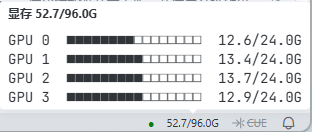

# Easy GPU

TraeCode / VS Code 的远程 GPU 监控面板：侧边栏监控页 + 状态栏常驻显存合计。

## 1. 作者 / 仓库

1. 作者：[@yourkwan](https://github.com/yourkwan)
2. 仓库：[yourkwan/easy-gpu](https://github.com/yourkwan/easy-gpu)
3. 反馈：[Issues](https://github.com/yourkwan/easy-gpu/issues)

## 2. 预览

1. 侧边栏

2. 状态栏（悬停显示每卡明细）

## 3. 功能

1. **侧边栏监控页**：每卡显存大号数字 + 进度条，温度 / 利用率仅异常着色；点击显卡展开该卡用户显存
2. **逐进程显存**：gpustat 风格芯片流 `wzs 6876M ǀ lj 814M`，可一键合并同一用户进程
3. **状态栏常驻**：状态点 + 显存合计（如 `52.7/96.0G`），悬停看每卡明细，点击打开侧边栏
4. **CPU 与内存**：实时占用 + 历史曲线，内存已用 / 总量 / 缓存 / 可用
5. **7 种强调色**：蓝 / 青 / 绿 / 紫 / 粉 / 橙 / 红，深浅主题自适应
6. **自动刷新**：默认 10 秒（可设 2–600 秒），支持手动刷新
7. **SSH 连接**：地址 → 用户名 → 密码 / 私钥 / ssh-agent 免密；凭据存系统钥匙串

## 4. 安装

1. 下载 [easy-gpu-1.2.0.vsix](easy-gpu-1.2.0.vsix)
2. 扩展面板（`Ctrl+Shift+X`）→ 右上角 `···` → **从 VSIX 安装…** → 重载窗口
3. 源码构建：`npm install && npm run package`

## 5. 使用

1. **新建连接**：命令面板执行 `Easy GPU: 新建连接（输入服务器地址与用户名）`
2. **查看监控**：点活动栏 Easy GPU 图标打开侧边栏；状态栏悬停看每卡明细，点击打开侧边栏
3. **切换服务器**：侧边栏「选择服务器」，或 `Easy GPU: 管理连接与密码`
4. **手动刷新**：侧边栏刷新按钮，或 `Easy GPU: 立即刷新`
5. **设置**：侧边栏齿轮 —— 刷新间隔 / 颜色风格 / 更多设置；「合并进程」用侧边栏按钮切换
