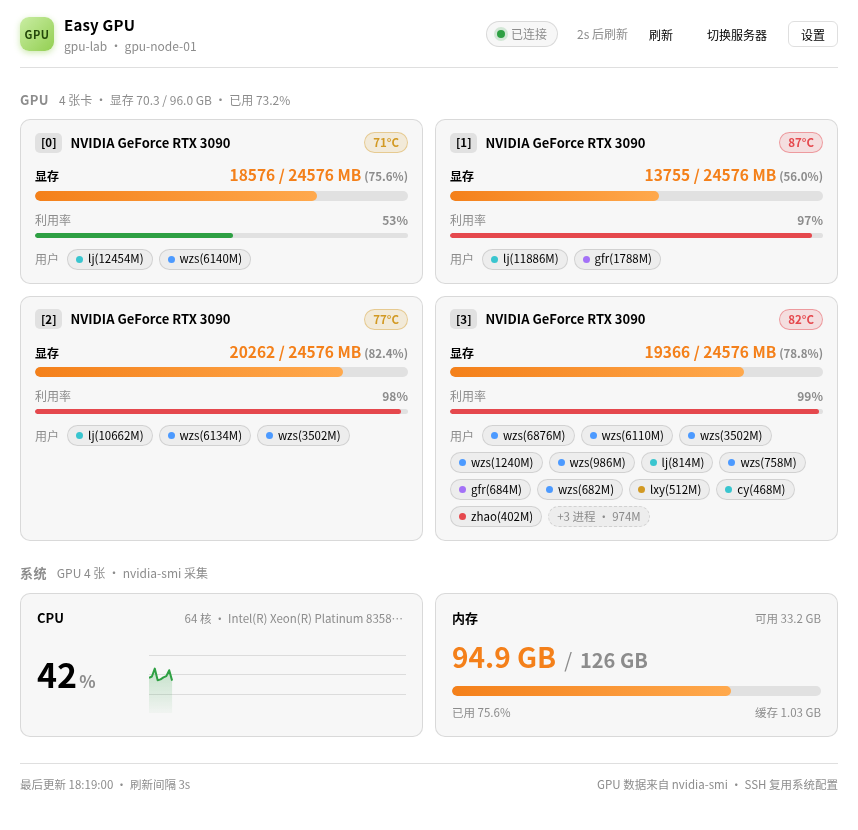
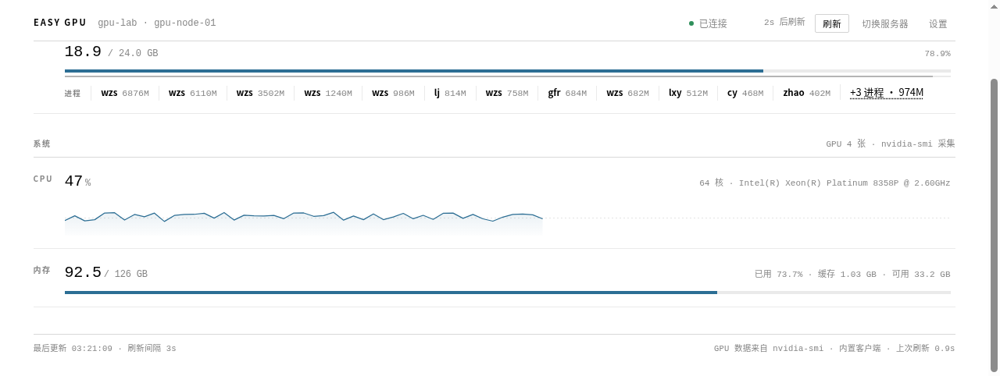

# Easy GPU

> 在 TraeCode / VS Code 中查看远程 SSH 服务器的 GPU、CPU 与内存状态 —— gpustat 风格面板，带逐进程显存占用统计。

  



## 功能

- **显存优先**：每张 GPU 的显存以等宽大号数值 + 细进度条突出显示，型号、温度、利用率作为辅助信息；温度 / 利用率只在异常时（≥80°C、≥98%）才转为警示色
- **逐进程显存占用**：gpustat 风格 `wzs 6876M ǀ lj 814M`，默认每个进程单独一条、不按用户合并，同一账号多个任务一目了然；可在设置里打开「合并同一用户的进程」改为按账号合计（`wzs 20154M`），悬停仍能看到每个 PID 的明细
- **一处式简洁设置**：面板右上角「设置」只有三项（刷新间隔 / 状态栏概览 / 进程合并），回车即可切换，不用去 VS Code 设置里翻
- **CPU 与内存**：CPU 实时占用 + 历史曲线；内存已用 / 总量 + 缓存与可用容量
- **状态栏常驻概览**：`GPU×4 显存 72.0/96.0G · 89°C | CPU 62% | RAM 94.6/126G`，点击直达面板
- **自动刷新**：默认每 5 秒，可配置；面板带刷新倒计时与手动刷新按钮
- **三步新建连接**：服务器地址 → 用户名 → 登录方式（密码 / 私钥文件 / ssh-agent 免密）
- **登录信息按用户区分**：密码与私钥口令以 `用户名@服务器` 分别保存到系统钥匙串，同一台服务器上的多个账号互不影响；私钥文件也按连接记录，**一个用户可以对应一个私钥**
- **一屏连接管理**：`Easy GPU: 管理连接与密码` 列出全部服务器（用户名 / 登录方式 / 是否已存密码），回车即连接，右侧按钮修改或删除
- **科研简约界面**：发丝线表格布局、单一墨蓝强调色、等宽数字对齐成列



## 安装

### TraeCode / VS Code（导入 VSIX）

1. 下载仓库中的 [easy-gpu-1.1.0.vsix](easy-gpu-1.1.0.vsix)
2. 打开扩展面板（`Ctrl+Shift+X` / `Cmd+Shift+X`），点击右上角 `···` → **从 VSIX 安装…**
   （也可在命令面板执行 `Extensions: Install from VSIX...`）
3. 重新加载窗口，左下角出现 `Easy GPU · 未连接`

### 从源码构建

```bash
npm install
npm run package   # 生成 easy-gpu-1.1.0.vsix
```

## 使用

1. 命令面板执行 `Easy GPU: 新建连接`（首次点状态栏 `Easy GPU` 也会自动进入）
2. 按三步填写：
   - **服务器地址**：IP、域名，或 `~/.ssh/config` 中的别名；也可直接写 `user@host:2222`
   - **用户名**：远程服务器上的登录账号（地址里已写 `user@` 时会自动跳过）
   - **登录方式**：密码 / 私钥文件 / ssh-agent 免密
3. 选「密码登录」会立即让你输入密码并存进系统钥匙串；选「私钥文件」会弹文件对话框选择私钥（加密私钥会询问口令，可留空稍后再输）
4. 保存后面板自动开始刷新；以后换服务器用 `Easy GPU: 管理连接与密码`，一屏切换即可

> 免密登录复用 `~/.ssh/config`（含 `IdentityFile`、`ProxyJump`）与 ssh-agent，不保存任何密码。
> 连接信息（服务器、用户名、登录方式、私钥路径）保存在扩展自己的连接列表里，不写进设置；密码与口令只进系统钥匙串。

| 命令 | 说明 |
| --- | --- |
| `Easy GPU: 打开监控面板` | 打开可视化仪表盘 |
| `Easy GPU: 新建连接` | 输入服务器地址与用户名，再选择密码 / 私钥 / 免密 |
| `Easy GPU: 管理连接与密码` | 列出全部连接：回车连接、右侧按钮修改或删除（同时清除已保存的密码） |
| `Easy GPU: 设置` | 刷新间隔 / 状态栏概览 / 进程合并，回车切换 |
| `Easy GPU: 立即刷新` | 立即采集一次数据（需要密码时会再次弹框） |

面板右上角「设置」与命令 `Easy GPU: 设置` 是同一个入口，改完即时生效。

| 配置 | 默认值 | 说明 |
| --- | --- | --- |
| `easy-gpu.refreshInterval` | `5` | 自动刷新间隔（秒）：一次刷新结束后再等这么久开始下一次 |
| `easy-gpu.mergeProcesses` | `false` | 把同一用户的多个进程合并成一条（显存合计） |
| `easy-gpu.showStatusBar` | `true` | 是否在状态栏显示概览 |

## 工作原理

扩展把 [`scripts/collect.sh`](scripts/collect.sh) 经 stdin 交给远程 `bash -s` 执行，采集完成后输出带标记的 JSON，由扩展解析渲染。投递通道按连接的**登录方式**自动选择：

- **密码 / 私钥文件** → 内置客户端：基于 [ssh2](https://github.com/mscdex/ssh2) 实现 SSH 协议，认证信息与错误提示最明确；私钥可指定任意路径，加密私钥会先试钥匙串里的口令；首次连接记录主机密钥指纹（TOFU），密钥变化时弹窗确认；PuTTY 的 `.ppk` 会被识别并提示转换；连接复用，刷新时无需重新握手
- **ssh-agent / 免密** → 系统 ssh：调用本机 `ssh`，完整复用 `~/.ssh/config`（含 `IdentityFile`、`ProxyJump`、`Include` 等写法）与 ssh-agent

采集内容（两种方式一致）：

- GPU：`nvidia-smi --query-gpu`（型号/温度/利用率/显存）与 `--query-compute-apps`（进程显存），再用 `ps` 把 PID 映射到用户名
- CPU：两次采样 `/proc/stat` 计算实时占用；内存：`/proc/meminfo`

远程仅需 `bash` 与 coreutils（`awk`/`ps`），GPU 部分依赖 `nvidia-smi`（随 NVIDIA 驱动提供），无需 `jq`、Python 等额外依赖。

## 常见问题

| # | 问题 |
| --- | --- |
| 1 | [怎么用密码登录？](#1-怎么用密码登录) |
| 2 | [怎么用私钥文件登录？](#2-怎么用私钥文件登录) |
| 3 | [私钥有口令（passphrase）怎么办？](#3-私钥有口令passphrase怎么办) |
| 4 | [提示「SSH 认证失败」怎么办？](#4-提示ssh-认证失败怎么办) |
| 5 | [忘记已保存的密码 / 想换密码怎么办？](#5-忘记已保存的密码--想换密码怎么办) |
| 6 | [密码存在哪里，安全吗？](#6-密码存在哪里安全吗) |
| 7 | [提示「主机密钥与已记录的不一致」怎么办？](#7-提示主机密钥与已记录的不一致怎么办) |
| 8 | [为什么删掉了密码 / 卸载了扩展还能自动连接？](#8-为什么删掉了密码--卸载了扩展还能自动连接) |
| 9 | [怎么彻底清理已保存的配置与凭据？](#9-怎么彻底清理已保存的配置与凭据) |
| 10 | [未检测到 nvidia-smi 怎么办？](#10-未检测到-nvidia-smi-怎么办) |
| 11 | [想监控 TraeCode Remote-SSH 当前连接的服务器怎么办？](#11-想监控-traecode-remote-ssh-当前连接的服务器怎么办) |
| 12 | [为什么设了 5 秒刷新，实际每次都更久？](#12-为什么设了-5-秒刷新实际每次都更久) |

### 1. 怎么用密码登录？
执行 `Easy GPU: 新建连接`，依次填服务器地址、用户名，登录方式选「密码登录」，输入一次密码即可 —— 密码保存在系统钥匙串，之后自动连接。想改密码：`Easy GPU: 管理连接与密码` → 在该连接右侧点「修改」。

### 2. 怎么用私钥文件登录？
在新建（或修改）连接时，把登录方式选为「私钥文件」，文件对话框里选中私钥即可。每条连接各自记录私钥路径，所以**同一台服务器上的不同用户可以用各自的私钥**。也可以把私钥写进 `~/.ssh/config` 的 `IdentityFile`，并把登录方式设为「ssh-agent / 免密」。

注意：PuTTY 的 `.ppk` 文件无法直接使用，需先用 **PuTTYgen → Conversions → Export OpenSSH key** 转成 OpenSSH 格式（扩展检测到 `.ppk` 会给出这个提示）。

### 3. 私钥有口令（passphrase）怎么办？
选择私钥时若检测到加密，会立即询问口令（也可留空，连接时再问）；口令按 `用户名@服务器` 保存在系统钥匙串，之后自动解锁。口令失效会自动清除并重新询问。

### 4. 提示「SSH 认证失败」怎么办？
- 面板会显示失败原因；点「立即重试」会按当前登录方式重试（需要密码时会再次弹框）
- 想换登录方式：`Easy GPU: 管理连接与密码` → 该连接右侧「修改」
- 想彻底免密：在终端执行 `ssh-copy-id your-server`（或把私钥加入 ssh-agent），确认 `ssh your-server 'echo ok'` 无需密码，再把登录方式设为「ssh-agent / 免密」

### 5. 忘记已保存的密码 / 想换密码怎么办？
执行 `Easy GPU: 管理连接与密码`，在该连接上点右侧的「修改」（铅笔）按钮重新输入密码；想直接丢弃就用「删除」（垃圾桶），密码与口令会一并从钥匙串清除。

### 6. 密码存在哪里，安全吗？
存在 VS Code 的 SecretStorage（macOS Keychain / Windows 凭据管理器 / Linux libsecret），键是 `用户名@服务器:端口`，因此同一台服务器的不同账号各存各的；不会写入 `settings.json`。删除该连接即删除对应密码。

### 7. 提示「主机密钥与已记录的不一致」怎么办？
内置客户端首次连接会记住服务器指纹；服务器重装或更换过密钥时会弹窗，确认后才继续连接（防止中间人攻击）。

### 8. 为什么删掉了密码 / 卸载了扩展还能自动连接？
- **私钥文件与 ssh-agent 免密本来就不需要保存密码**：扩展直接读磁盘上的私钥，或使用 ssh-agent 里已加载的密钥。要停用就把该连接的登录方式改成密码，或在「管理连接与密码」里删除这条连接
- 「删除连接」只清除该连接的密码 / 口令与配置；**卸载扩展不会删除**连接列表与钥匙串条目（VS Code 通用行为），且卸载后需要重新加载窗口才真正停止运行

### 9. 怎么彻底清理已保存的配置与凭据？
1. 卸载**前**先执行 `Easy GPU: 管理连接与密码`，把连接逐条删除（会同时清掉钥匙串里的密码与口令）
2. 卸载扩展 → 命令面板执行 `Developer: Reload Window`
3. 设置里只剩 `easy-gpu.refreshInterval`、`easy-gpu.mergeProcesses`、`easy-gpu.showStatusBar` 三项，如需清理可在用户设置 JSON 中删掉

### 10. 未检测到 nvidia-smi 怎么办？
服务器没有 NVIDIA 驱动，或当前账号无执行权限（容器内还需映射 GPU）；CPU 与内存监控不受影响。

### 11. 想监控 TraeCode Remote-SSH 当前连接的服务器怎么办？
在 `~/.ssh/config` 里找到对应别名，新建连接时选它即可（用户名/端口会自动带出）；也可以直接输入同样的 `user@host`。

### 12. 为什么设了 5 秒刷新，实际每次都更久？
5 秒是**间隔**不是**超时**：如果一次刷新本身耗时超过 5 秒，下一次会等它结束后才触发（同一时间只跑一个刷新），所以实际节奏 = 单次耗时 + 5 秒。单次耗时来自两部分：

- **SSH 连接**：密码 / 私钥登录走内置客户端并复用长连接，只有脚本执行时间；免密走系统 ssh，类 Unix 会复用连接（`ControlMaster`），**Windows 自带 OpenSSH 不支持连接复用，每次刷新都要重新握手**（局域网 1–3 秒，跨公网更久）
- **远程采集脚本**：CPU 采样固定 0.4 秒 + 2 次 `nvidia-smi`（GPU 繁忙或驱动异常时单次可达数秒）

诊断方法：**面板底部**显示「刷新耗时 X.XXs」（最近一次刷新的实际耗时），鼠标悬停状态栏的 `Easy GPU` 还能看到实际通道（内置客户端 / 系统 ssh）与耗时。若显示走的是系统 ssh 且耗时高，把该连接的登录方式改成「密码」或「私钥文件」即可复用长连接；也可以把 `easy-gpu.refreshInterval` 调大（如 10–15 秒）。

## 开发

```bash
npm install          # 安装依赖
npm run compile      # 编译 TypeScript
npm run watch        # 监听编译
node dev/test-collect.mjs      # 采集脚本 + ssh config 解析 + 系统 ssh 链路自测（含假 GPU 数据）
node dev/test-builtin-ssh.mjs  # 内置 SSH 客户端端到端测试（本地模拟 SSH 服务器：密码、主机密钥、连接复用）
python3 -m http.server 8090    # 浏览器预览面板（mock 数据）：dev/preview.html
```

## License

[MIT](LICENSE)